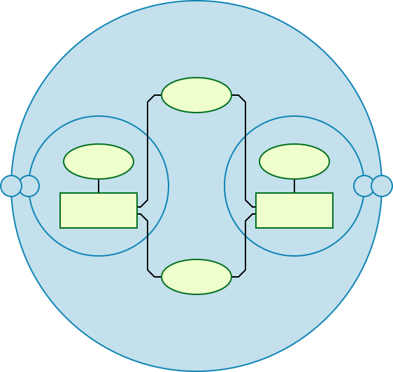
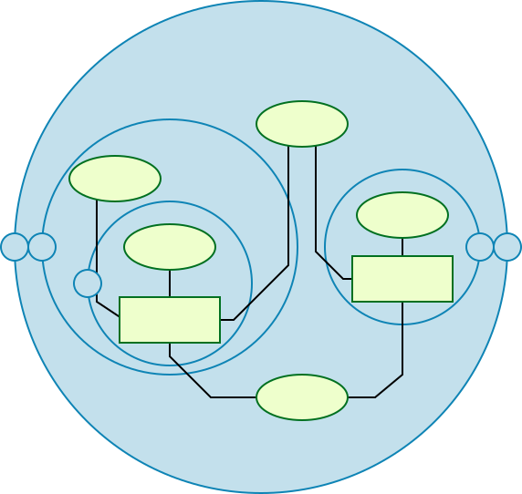
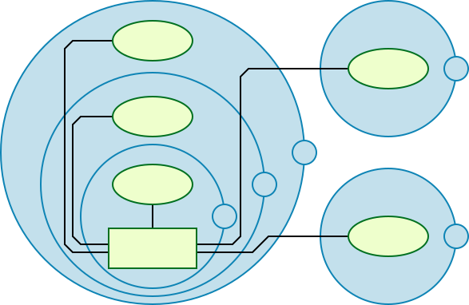
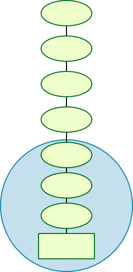
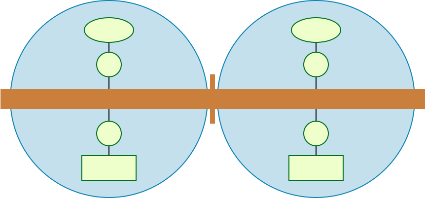
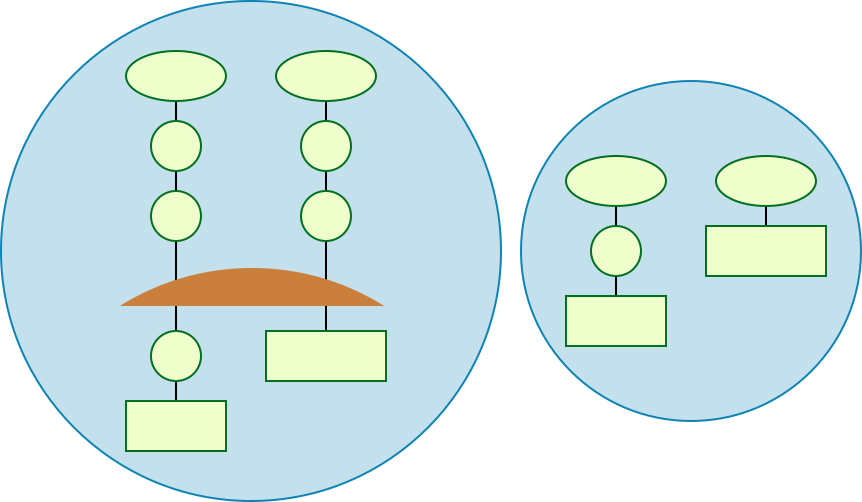

.. _fixture:
.. _fixtures:
.. _`fixture functions`:

pytest fixtures: explicit, modular, scalable
========================================================

.. currentmodule:: _pytest.python

.. _`xUnit`: https://en.wikipedia.org/wiki/XUnit
.. _`Software test fixtures`: https://en.wikipedia.org/wiki/Test_fixture#Software
.. _`Dependency injection`: https://en.wikipedia.org/wiki/Dependency_injection
.. _`Transaction`: https://en.wikipedia.org/wiki/Transaction_processing
.. _`linearizable`: https://en.wikipedia.org/wiki/Linearizability

`Software test fixtures`_ initialize test functions.  They provide a
fixed baseline so that tests execute reliably and produce consistent,
repeatable, results.  Initialization may setup services, state, or
other operating environments.  These are accessed by test functions
through arguments; for each fixture used by a test function there is
typically a parameter (named after the fixture) in the test function's
definition.

pytest fixtures offer dramatic improvements over the classic xUnit
style of setup/teardown functions:

* fixtures have explicit names and are activated by declaring their use
  from test functions, modules, classes or whole projects.

* fixtures are implemented in a modular manner, as each fixture name
  triggers a *fixture function* which can itself use other fixtures.

* fixture management scales from simple unit to complex
  functional testing, allowing to parametrize fixtures and tests according
  to configuration and component options, or to re-use fixtures
  across function, class, module or whole test session scopes.

* teardown logic can be easily, and safely managed, no matter how many fixtures
  are used, without the need to carefully handle errors by hand or micromanage
  the order that cleanup steps are added.

In addition, pytest continues to support :ref:`xunitsetup`.  You can mix
both styles, moving incrementally from classic to new style, as you
prefer.  You can also start out from existing :ref:`unittest.TestCase
style <unittest.TestCase>` or :ref:`nose based <nosestyle>` projects.

:ref:`Fixtures <fixtures-api>` are defined using the
:ref:`@pytest.fixture <pytest.fixture-api>` decorator, :ref:`described
below <funcargs>`. Pytest has useful built-in fixtures, listed here
for reference:

   :fixture:`capfd`
        Capture, as text, output to file descriptors ``1`` and ``2``.

   :fixture:`capfdbinary`
        Capture, as bytes, output to file descriptors ``1`` and ``2``.

   :fixture:`caplog`
        Control logging and access log entries.

   :fixture:`capsys`
        Capture, as text, output to ``sys.stdout`` and ``sys.stderr``.

   :fixture:`capsysbinary`
        Capture, as bytes, output to ``sys.stdout`` and ``sys.stderr``.

   :fixture:`cache`
        Store and retrieve values across pytest runs.

   :fixture:`doctest_namespace`
        Provide a dict injected into the docstests namespace.

   :fixture:`monkeypatch`
       Temporarily modify classes, functions, dictionaries,
       ``os.environ``, and other objects.

   :fixture:`pytestconfig`
        Access to configuration values, pluginmanager and plugin hooks.

   :fixture:`record_property`
       Add extra properties to the test.

   :fixture:`record_testsuite_property`
       Add extra properties to the test suite.

   :fixture:`recwarn`
        Record warnings emitted by test functions.

   :fixture:`request`
       Provide information on the executing test function.

   :fixture:`testdir`
        Provide a temporary test directory to aid in running, and
        testing, pytest plugins.

   :fixture:`tmp_path`
       Provide a :class:`pathlib.Path` object to a temporary directory
       which is unique to each test function.

   :fixture:`tmp_path_factory`
        Make session-scoped temporary directories and return
        :class:`pathlib.Path` objects.

   :fixture:`tmpdir`
        Provide a :class:`py.path.local` object to a temporary
        directory which is unique to each test function;
        replaced by :fixture:`tmp_path`.

        .. _`py.path.local`: https://py.readthedocs.io/en/latest/path.html

   :fixture:`tmpdir_factory`
        Make session-scoped temporary directories and return
        :class:`py.path.local` objects;
        replaced by :fixture:`tmp_path_factory`.

.. _`funcargs`:
.. _`funcarg mechanism`:
.. _`fixture function`:
.. _`@pytest.fixture`:
.. _`pytest.fixture`:

What fixtures are
-----------------

Before we dive into what fixtures are, let's first look at what a test is.

In the simplest terms, a test is meant to look at the result of a particular
behavior, and make sure that result aligns with what you would expect.
Behavior is not something that can be empirically measured, which is why writing
tests can be challenging.

"Behavior" is the way in which some system **acts in response** to a particular
situation and/or stimuli. But exactly *how* or *why* something is done is not
quite as important as *what* was done.

You can think of a test as being broken down into four steps:

1. **Arrange**
2. **Act**
3. **Assert**
4. **Cleanup**

**Arrange** is where we prepare everything for our test. This means pretty
much everything except for the "**act**". It's lining up the dominoes so that
the **act** can do its thing in one, state-changing step. This can mean
preparing objects, starting/killing services, entering records into a database,
or even things like defining a URL to query, generating some credentials for a
user that doesn't exist yet, or just waiting for some process to finish.

**Act** is the singular, state-changing action that kicks off the **behavior**
we want to test. This behavior is what carries out the changing of the state of
the system under test (SUT), and it's the resulting changed state that we can
look at to make a judgement about the behavior. This typically takes the form of
a function/method call.

**Assert** is where we look at that resulting state and check if it looks how
we'd expect after the dust has settled. It's where we gather evidence to say the
behavior does or does not aligns with what we expect. The ``assert`` in our test
is where we take that measurement/observation and apply our judgement to it. If
something should be green, we'd say ``assert thing == "green"``.

**Cleanup** is where the test picks up after itself, so other tests aren't being
accidentally influenced by it.

At it's core, the test is ultimately the **act** and **assert** steps, with the
**arrange** step only providing the context. **Behavior** exists between **act**
and **assert**.

Back to fixtures
^^^^^^^^^^^^^^^^

"Fixtures", in the literal sense, are each of the **arrange** steps and data. They're
everything that test needs to do its thing.

At a basic level, test functions request fixtures by declaring them as
arguments, as in the ``test_ehlo(smtp_connection):`` in the previous example.

In pytest, "fixtures" are functions you define that serve this purpose. But they
don't have to be limited to just the **arrange** steps. They can provide the
**act** step, as well, and this can be a powerful technique for designing more
complex tests, especially given how pytest's fixture system works. But we'll get
into that further down.

We can tell pytest that a particular function is a fixture by decorating it with
:py:func:`@pytest.fixture <pytest.fixture>`. Here's a simple example of
what a fixture in pytest might look like:

.. code-block:: python

    import pytest

    class Fruit:
        def __init__(self, name):
            self.name = name

        def __eq__(self, other):
            return self.name == other.name

    @pytest.fixture
    def my_fruit():
        return Fruit("apple")

    @pytest.fixture
    def fruit_basket(my_fruit):
        return [Fruit("banana"), my_fruit]

    def test_my_fruit_in_basket(my_fruit, fruit_basket):
        assert my_fruit in fruit_basket

Tests don't have to be limited to a single fixture, either. They can depend on
as many fixtures as you want, and fixtures can use other fixtures, as well. This
is where pytest's fixture system really shines.

Don't be afraid to break things up if it makes things cleaner.

"Requesting" fixtures
---------------------

So fixtures are how we *prepare* for a test, but how do we tell pytest what
tests and fixtures need which fixtures?

At a basic level, test functions request fixtures by declaring them as
arguments, as in the ``test_my_fruit_in_basket(my_fruit, fruit_basket):`` in the
previous example.

At a basic level, pytest depends on a test to tell it what fixtures it needs, so
we have to build that information into the test itself. We have to make the test
"**request**" the fixtures it depends on, and to do this, we have to
list those fixtures as parameters in the test function's "signature" (which is
the ``def test_something(blah, stuff, more):`` line).

When pytest goes to run a test, it looks at the parameters in that test
function's signature, and then searches for fixtures that have the same names as
those parameters. Once pytest finds them, it runs those fixtures, captures what
they returned (if anything), and passes those objects into the test function as
arguments.

Quick example
^^^^^^^^^^^^^

.. code-block:: python

    import pytest

    class Fruit:
        def __init__(self, name):
            self.name = name
            self.cubed = False

        def cube(self):
            self.cubed = True

    class FruitSalad:
        def __init__(self, *fruit_bowl):
            self.fruit = fruit_bowl
            self._cube_fruit()

        def _cube_fruit(self):
            for fruit in self.fruit:
                fruit.cube()

    # Arrange
    @pytest.fixture
    def fruit_bowl():
        return [Fruit("apple"), Fruit("banana")]

    def test_fruit_salad(fruit_bowl):
        # Act
        fruit_salad = FruitSalad(*fruit_bowl)

        # Assert
        assert all(fruit.cubed for fruit in fruit_salad.fruit)

In this example, ``test_fruit_salad`` "**requests**" ``fruit_bowl`` (i.e.
``def test_fruit_salad(fruit_bowl):``), and when pytest sees this, it will
execute the ``fruit_bowl`` fixture function and pass the object it returns into
``test_fruit_salad`` as the ``fruit_bowl`` argument.

Here's roughly
what's happening if we were to do it by hand:

.. code-block:: python

    def fruit_bowl():
        return [Fruit("apple"), Fruit("banana")]

    def test_fruit_salad(fruit_bowl):
        # Act
        fruit_salad = FruitSalad(*fruit_bowl)

        # Assert
        assert all(fruit.cubed for fruit in fruit_salad.fruit)

    # Arrange
    bowl = fruit_bowl()
    test_fruit_salad(fruit_bowl=bowl)

Fixtures can **request** other fixtures
^^^^^^^^^^^^^^^^^^^^^^^^^^^^^^^^^^^^^^^

One of pytest's greatest strengths is its extremely flexible fixture system. It
allows us to boil down complex requirements for tests into more simple and
organized functions, where we only need to have each one describe the things
they are dependent on. We'll get more into this further down, but for now,
here's a quick example to demonstrate how fixtures can use other fixtures:

.. code-block:: python

    # contents of test_append.py
    import pytest

    # Arrange
    @pytest.fixture
    def first_entry():
        return "a"

    # Arrange
    @pytest.fixture
    def order(first_entry):
        return [first_entry]

    def test_string(order):
        # Act
        order.append("b")

        # Assert
        assert order == ["a", "b"]

Notice that this is the same example from above, but very little changed. The
fixtures in pytest **request** fixtures just like tests. All the same
**requesting** rules apply to fixtures that do for tests. Here's how this
example would work if we did it by hand:

.. code-block:: python

    def first_entry():
        return "a"

    def order(first_entry):
        return [first_entry]

    def test_string(order):
        # Act
        order.append("b")

        # Assert
        assert order == ["a", "b"]

    entry = first_entry()
    the_list = order(first_entry=entry)
    test_string(order=the_list)

Fixtures are reusable
^^^^^^^^^^^^^^^^^^^^^

One of the things that makes pytest's fixture system so powerful, is that it
gives us the abilty to define a generic setup step that can reused over and
over, just like a normal function would be used. Two different tests can request
the same fixture and have pytest give each test their own result from that
fixture.

This is extremely useful for making sure tests aren't affected by each other. We
can use this system to make sure each test gets its own fresh batch of data and
is starting from a clean state so it can provide consistent, repeatable results.

Here's an example of how this can come in handy:

.. code-block:: python

    # contents of test_append.py
    import pytest

    # Arrange
    @pytest.fixture
    def first_entry():
        return "a"

    # Arrange
    @pytest.fixture
    def order(first_entry):
        return [first_entry]

    def test_string(order):
        # Act
        order.append("b")

        # Assert
        assert order == ["a", "b"]

    def test_int(order):
        # Act
        order.append(2)

        # Assert
        assert order == ["a", 2]

Each test here is being given its own copy of that ``list`` object,
which means the ``order`` fixture is getting executed twice (the same
is true for the ``first_entry`` fixture). If we were to do this by hand as
well, it would look something like this:

.. code-block:: python

    def first_entry():
        return "a"

    def order(first_entry):
        return [first_entry]

    def test_string(order):
        # Act
        order.append("b")

        # Assert
        assert order == ["a", "b"]

    def test_int(order):
        # Act
        order.append(2)

        # Assert
        assert order == ["a", 2]

    entry = first_entry()
    the_list = order(first_entry=entry)
    test_string(order=the_list)

    entry = first_entry()
    the_list = order(first_entry=entry)
    test_int(order=the_list)

A test/fixture can **request** more than one fixture at a time
^^^^^^^^^^^^^^^^^^^^^^^^^^^^^^^^^^^^^^^^^^^^^^^^^^^^^^^^^^^^^^

Tests and fixtures aren't limited to **requesting** a single fixture at a time.
They can request as many as they like. Here's another quick example to
demonstrate:

.. code-block:: python

    # contents of test_append.py
    import pytest

    # Arrange
    @pytest.fixture
    def first_entry():
        return "a"

    # Arrange
    @pytest.fixture
    def second_entry():
        return 2

    # Arrange
    @pytest.fixture
    def order(first_entry, second_entry):
        return [first_entry, second_entry]

    # Arrange
    @pytest.fixture
    def expected_list():
        return ["a", 2, 3.0]

    def test_string(order, expected_list):
        # Act
        order.append(3.0)

        # Assert
        assert order == expected_list

Fixtures can be **requested** more than once per test (return values are cached)
^^^^^^^^^^^^^^^^^^^^^^^^^^^^^^^^^^^^^^^^^^^^^^^^^^^^^^^^^^^^^^^^^^^^^^^^^^^^^^^^

Fixtures can also be **requested** more than once during the same test, and
pytest won't execute them again for that test. This means we can **request**
fixtures in multiple fixtures that are dependent on them (and even again in the
test itself) without those fixtures being executed more than once.

.. code-block:: python

    # contents of test_append.py
    import pytest

    # Arrange
    @pytest.fixture
    def first_entry():
        return "a"

    # Arrange
    @pytest.fixture
    def order():
        return []

    # Act
    @pytest.fixture
    def append_first(order, first_entry):
        return order.append(first_entry)

    def test_string_only(append_first, order, first_entry):
        # Assert
        assert order == [first_entry]

If a **requested** fixture was executed once for every time it was **requested**
during a test, then this test would fail because both ``append_first`` and
``test_string_only`` would see ``order`` as an empty list (i.e. ``[]``), but
since the return value of ``order`` was cached (along with any side effects
executing it may have had) after the first time it was called, both the test and
``append_first`` were referencing the same object, and the test saw the effect
``append_first`` had on that object.

.. _`autouse`:
.. _`autouse fixtures`:

Autouse fixtures (fixtures you don't have to request)
-----------------------------------------------------

Sometimes you may want to have a fixture (or even several) that you know all
your tests will depend on. "Autouse" fixtures are a convenient way to make all
tests automatically **request** them. This can cut out a
lot of redundant **requests**, and can even provide more advanced fixture usage
(more on that further down).

We can make a fixture an autouse fixture by passing in ``autouse=True`` to the
fixture's decorator. Here's a simple example for how they can be used:

.. code-block:: python

    # contents of test_append.py
    import pytest

    @pytest.fixture
    def first_entry():
        return "a"

    @pytest.fixture
    def order(first_entry):
        return []

    @pytest.fixture(autouse=True)
    def append_first(order, first_entry):
        return order.append(first_entry)

    def test_string_only(order, first_entry):
        assert order == [first_entry]

    def test_string_and_int(order, first_entry):
        order.append(2)
        assert order == [first_entry, 2]

In this example, the ``append_first`` fixture is an autouse fixture. Because it
happens automatically, both tests are affected by it, even though neither test
**requested** it. That doesn't mean they *can't* be **requested** though; just
that it isn't *necessary*.

.. _smtpshared:

Scope: sharing fixtures across classes, modules, packages or session
--------------------------------------------------------------------

.. regendoc:wipe

Fixtures requiring network access depend on connectivity and are
usually time-expensive to create.  Extending the previous example, we
can add a ``scope="module"`` parameter to the
:py:func:`@pytest.fixture <pytest.fixture>` invocation
to cause a ``smtp_connection`` fixture function, responsible to create a connection to a preexisting SMTP server, to only be invoked
once per test *module* (the default is to invoke once per test *function*).
Multiple test functions in a test module will thus
each receive the same ``smtp_connection`` fixture instance, thus saving time.
Possible values for ``scope`` are: ``function``, ``class``, ``module``, ``package`` or ``session``.

The next example puts the fixture function into a separate ``conftest.py`` file
so that tests from multiple test modules in the directory can
access the fixture function:

.. code-block:: python

    # content of conftest.py
    import pytest
    import smtplib

    @pytest.fixture(scope="module")
    def smtp_connection():
        return smtplib.SMTP("smtp.gmail.com", 587, timeout=5)

.. code-block:: python

    # content of test_module.py

    def test_ehlo(smtp_connection):
        response, msg = smtp_connection.ehlo()
        assert response == 250
        assert b"smtp.gmail.com" in msg
        assert 0  # for demo purposes

    def test_noop(smtp_connection):
        response, msg = smtp_connection.noop()
        assert response == 250
        assert 0  # for demo purposes

Here, the ``test_ehlo`` needs the ``smtp_connection`` fixture value.  pytest
will discover and call the :py:func:`@pytest.fixture <pytest.fixture>`
marked ``smtp_connection`` fixture function.  Running the test looks like this:

.. code-block:: pytest

    $ pytest test_module.py
    =========================== test session starts ============================
    platform linux -- Python 3.x.y, pytest-6.x.y, py-1.x.y, pluggy-0.x.y
    cachedir: $PYTHON_PREFIX/.pytest_cache
    rootdir: $REGENDOC_TMPDIR
    collected 2 items

    test_module.py FF                                                    [100%]

    ================================= FAILURES =================================
    ________________________________ test_ehlo _________________________________

    smtp_connection = <smtplib.SMTP object at 0xdeadbeef>

        def test_ehlo(smtp_connection):
            response, msg = smtp_connection.ehlo()
            assert response == 250
            assert b"smtp.gmail.com" in msg
    >       assert 0  # for demo purposes
    E       assert 0

    test_module.py:7: AssertionError
    ________________________________ test_noop _________________________________

    smtp_connection = <smtplib.SMTP object at 0xdeadbeef>

        def test_noop(smtp_connection):
            response, msg = smtp_connection.noop()
            assert response == 250
    >       assert 0  # for demo purposes
    E       assert 0

    test_module.py:13: AssertionError
    ========================= short test summary info ==========================
    FAILED test_module.py::test_ehlo - assert 0
    FAILED test_module.py::test_noop - assert 0
    ============================ 2 failed in 0.12s =============================

You see the two ``assert 0`` failing and more importantly you can also see
that the **exactly same** ``smtp_connection`` object was passed into the
two test functions because pytest shows the incoming argument values in the
traceback.  As a result, the two test functions using ``smtp_connection`` run
as quick as a single one because they reuse the same instance.

If you decide that you rather want to have a session-scoped ``smtp_connection``
instance, you can simply declare it:

.. code-block:: python

    @pytest.fixture(scope="session")
    def smtp_connection():
        # the returned fixture value will be shared for
        # all tests requesting it
        ...

Fixture scopes
^^^^^^^^^^^^^^

Fixtures are created when first requested by a test, and are destroyed based on their ``scope``:

* ``function``: the default scope, the fixture is destroyed at the end of the test.
* ``class``: the fixture is destroyed during teardown of the last test in the class.
* ``module``: the fixture is destroyed during teardown of the last test in the module.
* ``package``: the fixture is destroyed during teardown of the last test in the package.
* ``session``: the fixture is destroyed at the end of the test session.

.. note::

    Pytest only caches one instance of a fixture at a time, which
    means that when using a parametrized fixture, pytest may invoke a fixture more than once in
    the given scope.

.. _dynamic scope:

Dynamic scope
^^^^^^^^^^^^^

.. versionadded:: 5.2

In some cases, you might want to change the scope of the fixture without changing the code.
To do that, pass a callable to ``scope``. The callable must return a string with a valid scope
and will be executed only once - during the fixture definition. It will be called with two
keyword arguments - ``fixture_name`` as a string and ``config`` with a configuration object.

This can be especially useful when dealing with fixtures that need time for setup, like spawning
a docker container. You can use the command-line argument to control the scope of the spawned
containers for different environments. See the example below.

.. code-block:: python

    def determine_scope(fixture_name, config):
        if config.getoption("--keep-containers", None):
            return "session"
        return "function"

    @pytest.fixture(scope=determine_scope)
    def docker_container():
        yield spawn_container()

Fixture errors
--------------

pytest does its best to put all the fixtures for a given test in a linear order
so that it can see which fixture happens first, second, third, and so on. If an
earlier fixture has a problem, though, and raises an exception, pytest will stop
executing fixtures for that test and mark the test as having an error.

When a test is marked as having an error, it doesn't mean the test failed,
though. It just means the test couldn't even be attempted because one of the
things it depends on had a problem.

This is one reason why it's a good idea to cut out as many unnecessary
dependencies as possible for a given test. That way a problem in something
unrelated isn't causing us to have an incomplete picture of what may or may not
have issues.

Here's a quick example to help explain:

.. code-block:: python

    import pytest

    @pytest.fixture
    def order():
        return []

    @pytest.fixture
    def append_first(order):
        order.append(1)

    @pytest.fixture
    def append_second(order, append_first):
        order.extend([2])

    @pytest.fixture(autouse=True)
    def append_third(order, append_second):
        order += [3]

    def test_order(order):
        assert order == [1, 2, 3]

If, for whatever reason, ``order.append(1)`` had a bug and it raises an exception,
we wouldn't be able to know if ``order.extend([2])`` or ``order += [3]`` would
also have problems. After ``append_first`` throws an exception, pytest won't run
any more fixtures for ``test_order``, and it won't even try to run
``test_order`` itself. The only things that would've run would be ``order`` and
``append_first``.

.. _`finalization`:

Teardown/Cleanup (AKA Fixture finalization)
-------------------------------------------

When we run our tests, we'll want to make sure they clean up after themselves so
they don't mess with any other tests (and also so that we don't leave behind a
mountain of test data to bloat the system). Fixtures in pytest offer a very
useful teardown system, which allows us to define the specific steps necessary
for each fixture to clean up after itself.

This system can be leveraged in two ways.

.. _`yield fixtures`:

1. ``yield`` fixtures (recommended)
^^^^^^^^^^^^^^^^^^^^^^^^^^^^^^^^^^^

"Yield" fixtures ``yield`` instead of ``return``. With these
fixtures, we can run some code and pass an object back to the requesting
fixture/test, just like with the other fixtures. The only differences are:

1. ``return`` is swapped out for ``yield``.
2. Any teardown code for that fixture is placed *after* the ``yield``.

Once pytest figures out a linear order for the fixtures, it will run each one up
until it returns or yields, and then move on to the next fixture in the list to
do the same thing.

Once the test is finished, pytest will go back down the list of fixtures, but in
the *reverse order*, taking each one that yielded, and running the code inside
it that was *after* the ``yield`` statement.

As a simple example, let's say we want to test sending email from one user to
another. We'll have to first make each user, then send the email from one user
to the other, and finally assert that the other user received that message in
their inbox. If we want to clean up after the test runs, we'll likely have to
make sure the other user's mailbox is emptied before deleting that user,
otherwise the system may complain.

Here's what that might look like:

.. code-block:: python

    import pytest

    from emaillib import Email, MailAdminClient

    @pytest.fixture
    def mail_admin():
        return MailAdminClient()

    @pytest.fixture
    def sending_user(mail_admin):
        user = mail_admin.create_user()
        yield user
        admin_client.delete_user(user)

    @pytest.fixture
    def receiving_user(mail_admin):
        user = mail_admin.create_user()
        yield user
        admin_client.delete_user(user)

    def test_email_received(receiving_user, email):
        email = Email(subject="Hey!", body="How's it going?")
        sending_user.send_email(_email, receiving_user)
        assert email in receiving_user.inbox

Because ``receiving_user`` is the last fixture to run during setup, it's the first to run
during teardown.

There is a risk that even having the order right on the teardown side of things
doesn't guarantee a safe cleanup. That's covered in a bit more detail in
:ref:`safe teardowns`.

Handling errors for yield fixture
"""""""""""""""""""""""""""""""""

If a yield fixture raises an exception before yielding, pytest won't try to run
the teardown code after that yield fixture's ``yield`` statement. But, for every
fixture that has already run successfully for that test, pytest will still
attempt to tear them down as it normally would.

2. Adding finalizers directly
^^^^^^^^^^^^^^^^^^^^^^^^^^^^^

While yield fixtures are considered to be the cleaner and more straighforward
option, there is another choice, and that is to add "finalizer" functions
directly to the test's `request-context`_ object. It brings a similar result as
yield fixtures, but requires a bit more verbosity.

In order to use this approach, we have to request the `request-context`_ object
(just like we would request another fixture) in the fixture we need to add
teardown code for, and then pass a callable, containing that teardown code, to
its ``addfinalizer`` method.

We have to be careful though, because pytest will run that finalizer once it's
been added, even if that fixture raises an exception after adding the finalizer.
So to make sure we don't run the finalizer code when we wouldn't need to, we
would only add the finalizer once the fixture would have done something that
we'd need to teardown.

Here's how the previous example would look using the ``addfinalizer`` method:

.. code-block:: python

    import pytest

    from emaillib import Email, MailAdminClient

    @pytest.fixture
    def mail_admin():
        return MailAdminClient()

    @pytest.fixture
    def sending_user(mail_admin):
        user = mail_admin.create_user()
        yield user
        admin_client.delete_user(user)

    @pytest.fixture
    def receiving_user(mail_admin, request):
        user = mail_admin.create_user()

        def delete_user():
            admin_client.delete_user(user)

        request.addfinalizer(delete_user)
        return user

    @pytest.fixture
    def email(sending_user, receiving_user, request):
        _email = Email(subject="Hey!", body="How's it going?")
        sending_user.send_email(_email, receiving_user)

        def empty_mailbox():
            receiving_user.delete_email(_email)

        request.addfinalizer(empty_mailbox)
        return _email

    def test_email_received(receiving_user, email):
        assert email in receiving_user.inbox

It's a bit longer than yield fixtures and a bit more complex, but it
does offer some nuances for when you're in a pinch.

.. _`safe teardowns`:

Safe teardowns
--------------

The fixture system of pytest is *very* powerful, but it's still being run by a
computer, so it isn't able to figure out how to safely teardown everything we
throw at it. If we aren't careful, an error in the wrong spot might leave stuff
from our tests behind, and that can cause further issues pretty quickly.

For example, consider the following tests (based off of the mail example from
above):

.. code-block:: python

    import pytest

    from emaillib import Email, MailAdminClient

    @pytest.fixture
    def setup():
        mail_admin = MailAdminClient()
        sending_user = mail_admin.create_user()
        receiving_user = mail_admin.create_user()
        email = Email(subject="Hey!", body="How's it going?")
        sending_user.send_emai(email, receiving_user)
        yield receiving_user, email
        receiving_user.delete_email(email)
        admin_client.delete_user(sending_user)
        admin_client.delete_user(receiving_user)

    def test_email_received(setup):
        receiving_user, email = setup
        assert email in receiving_user.inbox

This version is a lot more compact, but it's also harder to read, doesn't have a
very descriptive fixture name, and none of the fixtures can be reused easily.

There's also a more serious issue, which is that if any of those steps in the
setup raise an exception, none of the teardown code will run.

One option might be to go with the ``addfinalizer`` method instead of yield
fixtures, but that might get pretty complex and difficult to maintain (and it
wouldn't be compact anymore).

.. _`safe fixture structure`:

Safe fixture structure
^^^^^^^^^^^^^^^^^^^^^^

The safest and simplest fixture structure requires limiting fixtures to only
making one state-changing action each, and then bundling them together with
their teardown code, as :ref:`the email examples above <yield fixtures>` showed.

The chance that a state-changing operation can fail but still modify state is
neglibible, as most of these operations tend to be `transaction`_-based (at
least at the level of testing where state could be left behind). So if we make
sure that any successful state-changing action gets torn down by moving it to a
separate fixture function and separating it from other, potentially failing
state-changing actions, then our tests will stand the best chance at leaving the
test environment the way they found it.

For an example, let's say we have a website with a login page, and we have
access to an admin API where we can generate users. For our test, we want to:

1. Create a user through that admin API
2. Launch a browser using Selenium
3. Go to the login page of our site
4. Log in as the user we created
5. Assert that their name is in the header of the landing page

We wouldn't want to leave that user in the system, nor would we want to leave
that browser session running, so we'll want to make sure the fixtures that
create those things clean up after themselves.

Here's what that might look like:

.. note::

    For this example, certain fixtures (i.e. ``base_url`` and
    ``admin_credentials``) are implied to exist elsewhere. So for now, let's
    assume they exist, and we're just not looking at them.

.. code-block:: python

    from uuid import uuid4
    from urllib.parse import urljoin

    from selenium.webdriver import Chrome
    import pytest

    from src.utils.pages import LoginPage, LandingPage
    from src.utils import AdminApiClient
    from src.utils.data_types import User

    @pytest.fixture
    def admin_client(base_url, admin_credentials):
        return AdminApiClient(base_url, **admin_credentials)

    @pytest.fixture
    def user(admin_client):
        _user = User(name="Susan", username=f"testuser-{uuid4()}", password="P4$$word")
        admin_client.create_user(_user)
        yield _user
        admin_client.delete_user(_user)

    @pytest.fixture
    def driver():
        _driver = Chrome()
        yield _driver
        _driver.quit()

    @pytest.fixture
    def login(driver, base_url, user):
        driver.get(urljoin(base_url, "/login"))
        page = LoginPage(driver)
        page.login(user)

    @pytest.fixture
    def landing_page(driver, login):
        return LandingPage(driver)

    def test_name_on_landing_page_after_login(landing_page, user):
        assert landing_page.header == f"Welcome, {user.name}!"

The way the dependencies are laid out means it's unclear if the ``user`` fixture
would execute before the ``driver`` fixture. But that's ok, because those are
atomic operations, and so it doesn't matter which one runs first because the
sequence of events for the test is still `linearizable`_. But what *does* matter
is that, no matter which one runs first, if the one raises an exception while
the other would not have, neither will have left anything behind. If ``driver``
executes before ``user``, and ``user`` raises an exception, the driver will
still quit, and the user was never made. And if ``driver`` was the one to raise
the exception, then the driver would never have been started and the user would
never have been made.

.. note:

    While the ``user`` fixture doesn't *actually* need to happen before the
    ``driver`` fixture, if we made ``driver`` request ``user``, it might save
    some time in the event that making the user raises an exception, since it
    won't bother trying to start the driver, which is a fairly expensive
    operation.

.. _`conftest.py`:
.. _`conftest`:

Fixture availabiility
---------------------

Fixture availability is determined from the perspective of the test. A fixture
is only available for tests to request if they are in the scope that fixture is
defined in. If a fixture is defined inside a class, it can only be requested by
tests inside that class. But if a fixture is defined inside the global scope of
the module, than every test in that module, even if it's defined inside a class,
can request it.

Similarly, a test can also only be affected by an autouse fixture if that test
is in the same scope that autouse fixture is defined in (see
:ref:`autouse order`).

A fixture can also request any other fixture, no matter where it's defined, so
long as the test requesting them can see all fixtures involved.

For example, here's a test file with a fixture (``outer``) that requests a
fixture (``inner``) from a scope it wasn't defined in:

.. literalinclude:: example/fixtures/test_fixtures_request_different_scope.py

From the tests' perspectives, they have no problem seeing each of the fixtures
they're dependent on:

So when they run, ``outer`` will have no problem finding ``inner``, because
pytest searched from the tests' perspectives.

.. note::
    The scope a fixture is defined in has no bearing on the order it will be
    instantiated in: the order is mandated by the logic described
    :ref:`here <fixture order>`.

``conftest.py``: sharing fixtures across multiple files
^^^^^^^^^^^^^^^^^^^^^^^^^^^^^^^^^^^^^^^^^^^^^^^^^^^^^^^

The ``conftest.py`` file serves as a means of providing fixtures for an entire
directory. Fixtures defined in a ``conftest.py`` can be used by any test
in that package without needing to import them (pytest will automatically
discover them).

You can have multiple nested directories/packages containing your tests, and
each directory can have its own ``conftest.py`` with its own fixtures, adding on
to the ones provided by the ``conftest.py`` files in parent directories.

For example, given a test file structure like this:

::

    tests/
        __init__.py

        conftest.py
            # content of tests/conftest.py
            import pytest

            @pytest.fixture
            def order():
                return []

            @pytest.fixture
            def top(order, innermost):
                order.append("top")

        test_top.py
            # content of tests/test_top.py
            import pytest

            @pytest.fixture
            def innermost(order):
                order.append("innermost top")

            def test_order(order, top):
                assert order == ["innermost top", "top"]

        subpackage/
            __init__.py

            conftest.py
                # content of tests/subpackage/conftest.py
                import pytest

                @pytest.fixture
                def mid(order):
                    order.append("mid subpackage")

            test_subpackage.py
                # content of tests/subpackage/test_subpackage.py
                import pytest

                @pytest.fixture
                def innermost(order, mid):
                    order.append("innermost subpackage")

                def test_order(order, top):
                    assert order == ["mid subpackage", "innermost subpackage", "top"]

The boundaries of the scopes can be visualized like this:

The directories become their own sort of scope where fixtures that are defined
in a ``conftest.py`` file in that directory become available for that whole
scope.

Tests are allowed to search upward (stepping outside a circle) for fixtures, but
can never go down (stepping inside a circle) to continue their search. So
``tests/subpackage/test_subpackage.py::test_order`` would be able to find the
``innermost`` fixture defined in ``tests/subpackage/test_subpackage.py``, but
the one defined in ``tests/test_top.py`` would be unavailable to it because it
would have to step down a level (step inside a circle) to find it.

The first fixture the test finds is the one that will be used, so
:ref:`fixtures can be overriden <override fixtures>` if you need to change or
extend what one does for a particular scope.

You can also use the ``conftest.py`` file to implement
:ref:`local per-directory plugins <conftest.py plugins>`.

Fixtures from third-party plugins
^^^^^^^^^^^^^^^^^^^^^^^^^^^^^^^^^

Fixtures don't have to be defined in this structure to be available for tests,
though. They can also be provided by third-party plugins that are installed, and
this is how many pytest plugins operate. As long as those plugins are installed,
the fixtures they provide can be requested from anywhere in your test suite.

Because they're provided from outside the structure of your test suite,
third-party plugins don't really provide a scope like `conftest.py` files and
the directories in your test suite do. As a result, pytest will search for
fixtures stepping out through scopes as explained previously, only reaching
fixtures defined in plugins *last*.

For example, given the following file structure:

::

    tests/
        __init__.py

        conftest.py
            # content of tests/conftest.py
            import pytest

            @pytest.fixture
            def order():
                return []

        subpackage/
            __init__.py

            conftest.py
                # content of tests/subpackage/conftest.py
                import pytest

                @pytest.fixture(autouse=True)
                def mid(order, b_fix):
                    order.append("mid subpackage")

            test_subpackage.py
                # content of tests/subpackage/test_subpackage.py
                import pytest

                @pytest.fixture
                def inner(order, mid, a_fix):
                    order.append("inner subpackage")

                def test_order(order, inner):
                    assert order == ["b_fix", "mid subpackage", "a_fix", "inner subpackage"]

If ``plugin_a`` is installed and provides the fixture ``a_fix``, and
``plugin_b`` is installed and provides the fixture ``b_fix``, then this is what
the test's search for fixtures would look like:

pytest will only search for ``a_fix`` and ``b_fix`` in the plugins after
searching for them first in the scopes inside ``tests/``.

.. note:

    pytest can tell you what fixtures are available for a given test if you call
    ``pytests`` along with the test's name (or the scope it's in), and provide
    the ``--fixtures`` flag, e.g. ``pytest --fixtures test_something.py``
    (fixtures with names that start with ``_`` will only be shown if you also
    provide the ``-v`` flag).

Sharing test data
-----------------

If you want to make test data from files available to your tests, a good way
to do this is by loading these data in a fixture for use by your tests.
This makes use of the automatic caching mechanisms of pytest.

Another good approach is by adding the data files in the ``tests`` folder.
There are also community plugins available to help managing this aspect of
testing, e.g. `pytest-datadir <https://pypi.org/project/pytest-datadir/>`__
and `pytest-datafiles <https://pypi.org/project/pytest-datafiles/>`__.

.. _`fixture order`:

Fixture instantiation order
---------------------------

When pytest wants to execute a test, once it knows what fixtures will be
executed, it has to figure out the order they'll be executed in. To do this, it
considers 3 factors:

1. scope
2. dependencies
3. autouse

Names of fixtures or tests, where they're defined, the order they're defined in,
and the order fixtures are requested in have no bearing on execution order
beyond coincidence. While pytest will try to make sure coincidences like these
stay consistent from run to run, it's not something that should be depended on.
If you want to control the order, it's safest to rely on these 3 things and make
sure dependencies are clearly established.

Higher-scoped fixtures are executed first
^^^^^^^^^^^^^^^^^^^^^^^^^^^^^^^^^^^^^^^^^^^^^

Within a function request for fixtures, those of higher-scopes (such as
``session``) are executed before lower-scoped fixtures (such as ``function`` or
``class``).

Here's an example:

.. literalinclude:: example/fixtures/test_fixtures_order_scope.py

The test will pass because the larger scoped fixtures are executing first.

The order breaks down to this:

Fixtures of the same order execute based on dependencies
^^^^^^^^^^^^^^^^^^^^^^^^^^^^^^^^^^^^^^^^^^^^^^^^^^^^^^^^^^^^

When a fixture requests another fixture, the other fixture is executed first.
So if fixture ``a`` requests fixture ``b``, fixture ``b`` will execute first,
because ``a`` depends on ``b`` and can't operate without it. Even if ``a``
doesn't need the result of ``b``, it can still request ``b`` if it needs to make
sure it is executed after ``b``.

For example:

.. literalinclude:: example/fixtures/test_fixtures_order_dependencies.py

If we map out what depends on what, we get something that look like this:

.. image:: example/fixtures/test_fixtures_order_dependencies.svg
    :align: center

The rules provided by each fixture (as to what fixture(s) each one has to come
after) are comprehensive enough that it can be flattened to this:

.. image:: example/fixtures/test_fixtures_order_dependencies_flat.svg
    :align: center

Enough information has to be provided through these requests in order for pytest
to be able to figure out a clear, linear chain of dependencies, and as a result,
an order of operations for a given test. If there's any ambiguity, and the order
of operations can be interpreted more than one way, you should assume pytest
could go with any one of those interpretations at any point.

For example, if ``d`` didn't request ``c``, i.e.the graph would look like this:

.. image:: example/fixtures/test_fixtures_order_dependencies_unclear.svg
    :align: center

Because nothing requested ``c`` other than ``g``, and ``g`` also requests ``f``,
it's now unclear if ``c`` should go before/after ``f``, ``e``, or ``d``. The
only rules that were set for ``c`` is that it must execute after ``b`` and
before ``g``.

pytest doesn't know where ``c`` should go in the case, so it should be assumed
that it could go anywhere between ``g`` and ``b``.

This isn't necessarily bad, but it's something to keep in mind. If the order
they execute in could affect the behavior a test is targetting, or could
otherwise influence the result of a test, then the order should be defined
explicitely in a way that allows pytest to linearize/"flatten" that order.

.. _`autouse order`:

Autouse fixtures are executed first within their scope
^^^^^^^^^^^^^^^^^^^^^^^^^^^^^^^^^^^^^^^^^^^^^^^^^^^^^^

Autouse fixtures are assumed to apply to every test that could reference them,
so they are executed before other fixtures in that scope. Fixtures that are
requested by autouse fixtures effectively become autouse fixtures themselves for
the tests that the real autouse fixture applies to.

So if fixture ``a`` is autouse and fixture ``b`` is not, but fixture ``a``
requests fixture ``b``, then fixture ``b`` will effectively be an autouse
fixture as well, but only for the tests that ``a`` applies to.

In the last example, the graph became unclear if ``d`` didn't request ``c``. But
if ``c`` was autouse, then ``b`` and ``a`` would effectively also be autouse
because ``c`` depends on them. As a result, they would all be shifted above
non-autouse fixtures within that scope.

So if the test file looked like this:

.. literalinclude:: example/fixtures/test_fixtures_order_autouse.py

the graph would look like this:

.. image:: example/fixtures/test_fixtures_order_autouse.svg
    :align: center

Because ``c`` can now be put above ``d`` in the graph, pytest can once again
linearize the graph to this:

In this example, ``c`` makes ``b`` and ``a`` effectively autouse fixtures as
well.

Be careful with autouse, though, as an autouse fixture will automatically
execute for every test that can reach it, even if they don't request it. For
example, consider this file:

.. literalinclude:: example/fixtures/test_fixtures_order_autouse_multiple_scopes.py

Even though nothing in ``TestClassWithC1Request`` is requesting ``c1``, it still
is executed for the tests inside it anyway:

But just because one autouse fixture requested a non-autouse fixture, that
doesn't mean the non-autouse fixture becomes an autouse fixture for all contexts
that it can apply to. It only effectively becomes an auotuse fixture for the
contexts the real autouse fixture (the one that requested the non-autouse
fixture) can apply to.

For example, take a look at this test file:

.. literalinclude:: example/fixtures/test_fixtures_order_autouse_temp_effects.py

It would break down to something like this:

For ``test_req`` and ``test_no_req`` inside ``TestClassWithAutouse``, ``c3``
effectively makes ``c2`` an autouse fixture, which is why ``c2`` and ``c3`` are
executed for both tests, despite not being requested, and why ``c2`` and ``c3``
are executed before ``c1`` for ``test_req``.

If this made ``c2`` an *actual* autouse fixture, then ``c2`` would also execute
for the tests inside ``TestClassWithoutAutouse``, since they can reference
``c2`` if they wanted to. But it doesn't, because from the perspective of the
``TestClassWithoutAutouse`` tests, ``c2`` isn't an autouse fixture, since they
can't see ``c3``.

.. note:

    pytest can tell you what order the fixtures will execute in for a given test
    if you call ``pytests`` along with the test's name (or the scope it's in),
    and provide the ``--setup-plan`` flag, e.g.
    ``pytest --setup-plan test_something.py`` (fixtures with names that start
    with ``_`` will only be shown if you also provide the ``-v`` flag).

Running multiple ``assert`` statements safely
---------------------------------------------

Sometimes you may want to run multiple asserts after doing all that setup, which
makes sense as, in more complex systems, a single action can kick off multiple
behaviors. pytest has a convenient way of handling this and it combines a bunch
of what we've gone over so far.

All that's needed is stepping up to a larger scope, then having the **act**
step defined as an autouse fixture, and finally, making sure all the fixtures
are targetting that highler level scope.

Let's pull :ref:`an example from above <safe fixture structure>`, and tweak it a
bit. Let's say that in addition to checking for a welcome message in the header,
we also want to check for a sign out button, and a link to the user's profile.

Let's take a look at how we can structure that so we can run multiple asserts
without having to repeat all those steps again.

.. note::

    For this example, certain fixtures (i.e. ``base_url`` and
    ``admin_credentials``) are implied to exist elsewhere. So for now, let's
    assume they exist, and we're just not looking at them.

.. code-block:: python

    # contents of tests/end_to_end/test_login.py
    from uuid import uuid4
    from urllib.parse import urljoin

    from selenium.webdriver import Chrome
    import pytest

    from src.utils.pages import LoginPage, LandingPage
    from src.utils import AdminApiClient
    from src.utils.data_types import User

    @pytest.fixture(scope="class")
    def admin_client(base_url, admin_credentials):
        return AdminApiClient(base_url, **admin_credentials)

    @pytest.fixture(scope="class")
    def user(admin_client):
        _user = User(name="Susan", username=f"testuser-{uuid4()}", password="P4$$word")
        admin_client.create_user(_user)
        yield _user
        admin_client.delete_user(_user)

    @pytest.fixture(scope="class")
    def driver():
        _driver = Chrome()
        yield _driver
        _driver.quit()

    @pytest.fixture(scope="class")
    def landing_page(driver, login):
        return LandingPage(driver)

    class TestLandingPageSuccess:
        @pytest.fixture(scope="class", autouse=True)
        def login(self, driver, base_url, user):
            driver.get(urljoin(base_url, "/login"))
            page = LoginPage(driver)
            page.login(user)

        def test_name_in_header(self, landing_page, user):
            assert landing_page.header == f"Welcome, {user.name}!"

        def test_sign_out_button(self, landing_page):
            assert landing_page.sign_out_button.is_displayed()

        def test_profile_link(self, landing_page, user):
            profile_href = urljoin(base_url, f"/profile?id={user.profile_id}")
            assert landing_page.profile_link.get_attribute("href") == profile_href

Notice that the methods are only referencing ``self`` in the signature as a
formality. No state is tied to the actual test class as it might be in the
``unittest.TestCase`` framework. Everything is managed by the pytest fixture
system.

Each method only has to request the fixtures that it actually needs without
worrying about order. This is because the **act** fixture is an autouse fixture,
and it made sure all the other fixtures executed before it. There's no more
changes of state that need to take place, so the tests are free to make as many
non-state-changing queries as they want without risking stepping on the toes of
the other tests.

The ``login`` fixture is defined inside the class as well, because not every one
of the other tests in the module will be expecting a successful login, and the **act** may need to
be handled a little differently for another test class. For example, if we
wanted to write another test scenario around submitting bad credentials, we
could handle it by adding something like this to the test file:

.. note:

    It's assumed that the page object for this (i.e. ``LoginPage``) raises a
    custom exception, ``BadCredentialsException``, when it recognizes text
    signifying that on the login form after attempting to log in.

.. code-block:: python

    class TestLandingPageBadCredentials:
        @pytest.fixture(scope="class")
        def faux_user(self, user):
            _user = deepcopy(user)
            _user.password = "badpass"
            return _user

        def test_raises_bad_credentials_exception(self, login_page, faux_user):
            with pytest.raises(BadCredentialsException):
                login_page.login(faux_user)

.. _`request-context`:

Fixtures can introspect the requesting test context
-------------------------------------------------------------

Fixture functions can accept the :py:class:`request <_pytest.fixtures.FixtureRequest>` object
to introspect the "requesting" test function, class or module context.
Further extending the previous ``smtp_connection`` fixture example, let's
read an optional server URL from the test module which uses our fixture:

.. code-block:: python

    # content of conftest.py
    import pytest
    import smtplib

    @pytest.fixture(scope="module")
    def smtp_connection(request):
        server = getattr(request.module, "smtpserver", "smtp.gmail.com")
        smtp_connection = smtplib.SMTP(server, 587, timeout=5)
        yield smtp_connection
        print("finalizing {} ({})".format(smtp_connection, server))
        smtp_connection.close()

We use the ``request.module`` attribute to optionally obtain an
``smtpserver`` attribute from the test module.  If we just execute
again, nothing much has changed:

.. code-block:: pytest

    $ pytest -s -q --tb=no
    FFfinalizing <smtplib.SMTP object at 0xdeadbeef> (smtp.gmail.com)

    ========================= short test summary info ==========================
    FAILED test_module.py::test_ehlo - assert 0
    FAILED test_module.py::test_noop - assert 0
    2 failed in 0.12s

Let's quickly create another test module that actually sets the
server URL in its module namespace:

.. code-block:: python

    # content of test_anothersmtp.py

    smtpserver = "mail.python.org"  # will be read by smtp fixture

    def test_showhelo(smtp_connection):
        assert 0, smtp_connection.helo()

Running it:

.. code-block:: pytest

    $ pytest -qq --tb=short test_anothersmtp.py
    F                                                                    [100%]
    ================================= FAILURES =================================
    ______________________________ test_showhelo _______________________________
    test_anothersmtp.py:6: in test_showhelo
        assert 0, smtp_connection.helo()
    E   AssertionError: (250, b'mail.python.org')
    E   assert 0
    ------------------------- Captured stdout teardown -------------------------
    finalizing <smtplib.SMTP object at 0xdeadbeef> (mail.python.org)
    ========================= short test summary info ==========================
    FAILED test_anothersmtp.py::test_showhelo - AssertionError: (250, b'mail....

voila! The ``smtp_connection`` fixture function picked up our mail server name
from the module namespace.

.. _`using-markers`:

Using markers to pass data to fixtures
-------------------------------------------------------------

Using the :py:class:`request <_pytest.fixtures.FixtureRequest>` object, a fixture can also access
markers which are applied to a test function. This can be useful to pass data
into a fixture from a test:

.. code-block:: python

    import pytest

    @pytest.fixture
    def fixt(request):
        marker = request.node.get_closest_marker("fixt_data")
        if marker is None:
            # Handle missing marker in some way...
            data = None
        else:
            data = marker.args[0]

        # Do something with the data
        return data

    @pytest.mark.fixt_data(42)
    def test_fixt(fixt):
        assert fixt == 42

.. _`fixture-factory`:

Factories as fixtures
-------------------------------------------------------------

The "factory as fixture" pattern can help in situations where the result
of a fixture is needed multiple times in a single test. Instead of returning
data directly, the fixture instead returns a function which generates the data.
This function can then be called multiple times in the test.

Factories can have parameters as needed:

.. code-block:: python

    @pytest.fixture
    def make_customer_record():
        def _make_customer_record(name):
            return {"name": name, "orders": []}

        return _make_customer_record

    def test_customer_records(make_customer_record):
        customer_1 = make_customer_record("Lisa")
        customer_2 = make_customer_record("Mike")
        customer_3 = make_customer_record("Meredith")

If the data created by the factory requires managing, the fixture can take care of that:

.. code-block:: python

    @pytest.fixture
    def make_customer_record():

        created_records = []

        def _make_customer_record(name):
            record = models.Customer(name=name, orders=[])
            created_records.append(record)
            return record

        yield _make_customer_record

        for record in created_records:
            record.destroy()

    def test_customer_records(make_customer_record):
        customer_1 = make_customer_record("Lisa")
        customer_2 = make_customer_record("Mike")
        customer_3 = make_customer_record("Meredith")

.. _`fixture-parametrize`:

Parametrizing fixtures
-----------------------------------------------------------------

Fixture functions can be parametrized in which case they will be called
multiple times, each time executing the set of dependent tests, i. e. the
tests that depend on this fixture.  Test functions usually do not need
to be aware of their re-running.  Fixture parametrization helps to
write exhaustive functional tests for components which themselves can be
configured in multiple ways.

Extending the previous example, we can flag the fixture to create two
``smtp_connection`` fixture instances which will cause all tests using the fixture
to run twice.  The fixture function gets access to each parameter
through the special :py:class:`request <FixtureRequest>` object:

.. code-block:: python

    # content of conftest.py
    import pytest
    import smtplib

    @pytest.fixture(scope="module", params=["smtp.gmail.com", "mail.python.org"])
    def smtp_connection(request):
        smtp_connection = smtplib.SMTP(request.param, 587, timeout=5)
        yield smtp_connection
        print("finalizing {}".format(smtp_connection))
        smtp_connection.close()

The main change is the declaration of ``params`` with
:py:func:`@pytest.fixture <pytest.fixture>`, a list of values
for each of which the fixture function will execute and can access
a value via ``request.param``.  No test function code needs to change.
So let's just do another run:

.. code-block:: pytest

    $ pytest -q test_module.py
    FFFF                                                                 [100%]
    ================================= FAILURES =================================
    ________________________ test_ehlo[smtp.gmail.com] _________________________

    smtp_connection = <smtplib.SMTP object at 0xdeadbeef>

        def test_ehlo(smtp_connection):
            response, msg = smtp_connection.ehlo()
            assert response == 250
            assert b"smtp.gmail.com" in msg
    >       assert 0  # for demo purposes
    E       assert 0

    test_module.py:7: AssertionError
    ________________________ test_noop[smtp.gmail.com] _________________________

    smtp_connection = <smtplib.SMTP object at 0xdeadbeef>

        def test_noop(smtp_connection):
            response, msg = smtp_connection.noop()
            assert response == 250
    >       assert 0  # for demo purposes
    E       assert 0

    test_module.py:13: AssertionError
    ________________________ test_ehlo[mail.python.org] ________________________

    smtp_connection = <smtplib.SMTP object at 0xdeadbeef>

        def test_ehlo(smtp_connection):
            response, msg = smtp_connection.ehlo()
            assert response == 250
    >       assert b"smtp.gmail.com" in msg
    E       AssertionError: assert b'smtp.gmail.com' in b'mail.python.org\nPIPELINING\nSIZE 51200000\nETRN\nSTARTTLS\nAUTH DIGEST-MD5 NTLM CRAM-MD5\nENHANCEDSTATUSCODES\n8BITMIME\nDSN\nSMTPUTF8\nCHUNKING'

    test_module.py:6: AssertionError
    -------------------------- Captured stdout setup ---------------------------
    finalizing <smtplib.SMTP object at 0xdeadbeef>
    ________________________ test_noop[mail.python.org] ________________________

    smtp_connection = <smtplib.SMTP object at 0xdeadbeef>

        def test_noop(smtp_connection):
            response, msg = smtp_connection.noop()
            assert response == 250
    >       assert 0  # for demo purposes
    E       assert 0

    test_module.py:13: AssertionError
    ------------------------- Captured stdout teardown -------------------------
    finalizing <smtplib.SMTP object at 0xdeadbeef>
    ========================= short test summary info ==========================
    FAILED test_module.py::test_ehlo[smtp.gmail.com] - assert 0
    FAILED test_module.py::test_noop[smtp.gmail.com] - assert 0
    FAILED test_module.py::test_ehlo[mail.python.org] - AssertionError: asser...
    FAILED test_module.py::test_noop[mail.python.org] - assert 0
    4 failed in 0.12s

We see that our two test functions each ran twice, against the different
``smtp_connection`` instances.  Note also, that with the ``mail.python.org``
connection the second test fails in ``test_ehlo`` because a
different server string is expected than what arrived.

pytest will build a string that is the test ID for each fixture value
in a parametrized fixture, e.g. ``test_ehlo[smtp.gmail.com]`` and
``test_ehlo[mail.python.org]`` in the above examples.  These IDs can
be used with ``-k`` to select specific cases to run, and they will
also identify the specific case when one is failing.  Running pytest
with ``--collect-only`` will show the generated IDs.

Numbers, strings, booleans and ``None`` will have their usual string
representation used in the test ID. For other objects, pytest will
make a string based on the argument name.  It is possible to customise
the string used in a test ID for a certain fixture value by using the
``ids`` keyword argument:

.. code-block:: python

   # content of test_ids.py
   import pytest

   @pytest.fixture(params=[0, 1], ids=["spam", "ham"])
   def a(request):
       return request.param

   def test_a(a):
       pass

   def idfn(fixture_value):
       if fixture_value == 0:
           return "eggs"
       else:
           return None

   @pytest.fixture(params=[0, 1], ids=idfn)
   def b(request):
       return request.param

   def test_b(b):
       pass

The above shows how ``ids`` can be either a list of strings to use or
a function which will be called with the fixture value and then
has to return a string to use.  In the latter case if the function
returns ``None`` then pytest's auto-generated ID will be used.

Running the above tests results in the following test IDs being used:

.. code-block:: pytest

   $ pytest --collect-only
   =========================== test session starts ============================
   platform linux -- Python 3.x.y, pytest-6.x.y, py-1.x.y, pluggy-0.x.y
   cachedir: $PYTHON_PREFIX/.pytest_cache
   rootdir: $REGENDOC_TMPDIR
   collected 10 items

   <Module test_anothersmtp.py>
     <Function test_showhelo[smtp.gmail.com]>
     <Function test_showhelo[mail.python.org]>
   <Module test_ids.py>
     <Function test_a[spam]>
     <Function test_a[ham]>
     <Function test_b[eggs]>
     <Function test_b[1]>
   <Module test_module.py>
     <Function test_ehlo[smtp.gmail.com]>
     <Function test_noop[smtp.gmail.com]>
     <Function test_ehlo[mail.python.org]>
     <Function test_noop[mail.python.org]>

   ======================= 10 tests collected in 0.12s ========================

.. _`fixture-parametrize-marks`:

Using marks with parametrized fixtures
--------------------------------------

:func:`pytest.param` can be used to apply marks in values sets of parametrized fixtures in the same way
that they can be used with :ref:`@pytest.mark.parametrize <@pytest.mark.parametrize>`.

Example:

.. code-block:: python

    # content of test_fixture_marks.py
    import pytest

    @pytest.fixture(params=[0, 1, pytest.param(2, marks=pytest.mark.skip)])
    def data_set(request):
        return request.param

    def test_data(data_set):
        pass

Running this test will *skip* the invocation of ``data_set`` with value ``2``:

.. code-block::

    $ pytest test_fixture_marks.py -v
    =========================== test session starts ============================
    platform linux -- Python 3.x.y, pytest-6.x.y, py-1.x.y, pluggy-0.x.y -- $PYTHON_PREFIX/bin/python
    cachedir: $PYTHON_PREFIX/.pytest_cache
    rootdir: $REGENDOC_TMPDIR
    collecting ... collected 3 items

    test_fixture_marks.py::test_data[0] PASSED                           [ 33%]
    test_fixture_marks.py::test_data[1] PASSED                           [ 66%]
    test_fixture_marks.py::test_data[2] SKIPPED (unconditional skip)     [100%]

    ======================= 2 passed, 1 skipped in 0.12s =======================

.. _`interdependent fixtures`:

Modularity: using fixtures from a fixture function
----------------------------------------------------------

In addition to using fixtures in test functions, fixture functions
can use other fixtures themselves.  This contributes to a modular design
of your fixtures and allows re-use of framework-specific fixtures across
many projects.  As a simple example, we can extend the previous example
and instantiate an object ``app`` where we stick the already defined
``smtp_connection`` resource into it:

.. code-block:: python

    # content of test_appsetup.py

    import pytest

    class App:
        def __init__(self, smtp_connection):
            self.smtp_connection = smtp_connection

    @pytest.fixture(scope="module")
    def app(smtp_connection):
        return App(smtp_connection)

    def test_smtp_connection_exists(app):
        assert app.smtp_connection

Here we declare an ``app`` fixture which receives the previously defined
``smtp_connection`` fixture and instantiates an ``App`` object with it.  Let's run it:

.. code-block:: pytest

    $ pytest -v test_appsetup.py
    =========================== test session starts ============================
    platform linux -- Python 3.x.y, pytest-6.x.y, py-1.x.y, pluggy-0.x.y -- $PYTHON_PREFIX/bin/python
    cachedir: $PYTHON_PREFIX/.pytest_cache
    rootdir: $REGENDOC_TMPDIR
    collecting ... collected 2 items

    test_appsetup.py::test_smtp_connection_exists[smtp.gmail.com] PASSED [ 50%]
    test_appsetup.py::test_smtp_connection_exists[mail.python.org] PASSED [100%]

    ============================ 2 passed in 0.12s =============================

Due to the parametrization of ``smtp_connection``, the test will run twice with two
different ``App`` instances and respective smtp servers.  There is no
need for the ``app`` fixture to be aware of the ``smtp_connection``
parametrization because pytest will fully analyse the fixture dependency graph.

Note that the ``app`` fixture has a scope of ``module`` and uses a
module-scoped ``smtp_connection`` fixture.  The example would still work if
``smtp_connection`` was cached on a ``session`` scope: it is fine for fixtures to use
"broader" scoped fixtures but not the other way round:
A session-scoped fixture could not use a module-scoped one in a
meaningful way.

.. _`automatic per-resource grouping`:

Automatic grouping of tests by fixture instances
----------------------------------------------------------

.. regendoc: wipe

pytest minimizes the number of active fixtures during test runs.
If you have a parametrized fixture, then all the tests using it will
first execute with one instance and then finalizers are called
before the next fixture instance is created.  Among other things,
this eases testing of applications which create and use global state.

The following example uses two parametrized fixtures, one of which is
scoped on a per-module basis, and all the functions perform ``print`` calls
to show the setup/teardown flow:

.. code-block:: python

    # content of test_module.py
    import pytest

    @pytest.fixture(scope="module", params=["mod1", "mod2"])
    def modarg(request):
        param = request.param
        print("  SETUP modarg", param)
        yield param
        print("  TEARDOWN modarg", param)

    @pytest.fixture(scope="function", params=[1, 2])
    def otherarg(request):
        param = request.param
        print("  SETUP otherarg", param)
        yield param
        print("  TEARDOWN otherarg", param)

    def test_0(otherarg):
        print("  RUN test0 with otherarg", otherarg)

    def test_1(modarg):
        print("  RUN test1 with modarg", modarg)

    def test_2(otherarg, modarg):
        print("  RUN test2 with otherarg {} and modarg {}".format(otherarg, modarg))

Let's run the tests in verbose mode and with looking at the print-output:

.. code-block:: pytest

    $ pytest -v -s test_module.py
    =========================== test session starts ============================
    platform linux -- Python 3.x.y, pytest-6.x.y, py-1.x.y, pluggy-0.x.y -- $PYTHON_PREFIX/bin/python
    cachedir: $PYTHON_PREFIX/.pytest_cache
    rootdir: $REGENDOC_TMPDIR
    collecting ... collected 8 items

    test_module.py::test_0[1]   SETUP otherarg 1
      RUN test0 with otherarg 1
    PASSED  TEARDOWN otherarg 1

    test_module.py::test_0[2]   SETUP otherarg 2
      RUN test0 with otherarg 2
    PASSED  TEARDOWN otherarg 2

    test_module.py::test_1[mod1]   SETUP modarg mod1
      RUN test1 with modarg mod1
    PASSED
    test_module.py::test_2[mod1-1]   SETUP otherarg 1
      RUN test2 with otherarg 1 and modarg mod1
    PASSED  TEARDOWN otherarg 1

    test_module.py::test_2[mod1-2]   SETUP otherarg 2
      RUN test2 with otherarg 2 and modarg mod1
    PASSED  TEARDOWN otherarg 2

    test_module.py::test_1[mod2]   TEARDOWN modarg mod1
      SETUP modarg mod2
      RUN test1 with modarg mod2
    PASSED
    test_module.py::test_2[mod2-1]   SETUP otherarg 1
      RUN test2 with otherarg 1 and modarg mod2
    PASSED  TEARDOWN otherarg 1

    test_module.py::test_2[mod2-2]   SETUP otherarg 2
      RUN test2 with otherarg 2 and modarg mod2
    PASSED  TEARDOWN otherarg 2
      TEARDOWN modarg mod2

    ============================ 8 passed in 0.12s =============================

You can see that the parametrized module-scoped ``modarg`` resource caused an
ordering of test execution that lead to the fewest possible "active" resources.
The finalizer for the ``mod1`` parametrized resource was executed before the
``mod2`` resource was setup.

In particular notice that test_0 is completely independent and finishes first.
Then test_1 is executed with ``mod1``, then test_2 with ``mod1``, then test_1
with ``mod2`` and finally test_2 with ``mod2``.

The ``otherarg`` parametrized resource (having function scope) was set up before
and teared down after every test that used it.

.. _`usefixtures`:

Use fixtures in classes and modules with ``usefixtures``
--------------------------------------------------------

.. regendoc:wipe

Sometimes test functions do not directly need access to a fixture object.
For example, tests may require to operate with an empty directory as the
current working directory but otherwise do not care for the concrete
directory.  Here is how you can use the standard `tempfile
<http://docs.python.org/library/tempfile.html>`_ and pytest fixtures to
achieve it.  We separate the creation of the fixture into a conftest.py
file:

.. code-block:: python

    # content of conftest.py

    import os
    import shutil
    import tempfile

    import pytest

    @pytest.fixture
    def cleandir():
        old_cwd = os.getcwd()
        newpath = tempfile.mkdtemp()
        os.chdir(newpath)
        yield
        os.chdir(old_cwd)
        shutil.rmtree(newpath)

and declare its use in a test module via a ``usefixtures`` marker:

.. code-block:: python

    # content of test_setenv.py
    import os
    import pytest

    @pytest.mark.usefixtures("cleandir")
    class TestDirectoryInit:
        def test_cwd_starts_empty(self):
            assert os.listdir(os.getcwd()) == []
            with open("myfile", "w") as f:
                f.write("hello")

        def test_cwd_again_starts_empty(self):
            assert os.listdir(os.getcwd()) == []

Due to the ``usefixtures`` marker, the ``cleandir`` fixture
will be required for the execution of each test method, just as if
you specified a "cleandir" function argument to each of them.  Let's run it
to verify our fixture is activated and the tests pass:

.. code-block:: pytest

    $ pytest -q
    ..                                                                   [100%]
    2 passed in 0.12s

You can specify multiple fixtures like this:

.. code-block:: python

    @pytest.mark.usefixtures("cleandir", "anotherfixture")
    def test():
        ...

and you may specify fixture usage at the test module level using :globalvar:`pytestmark`:

.. code-block:: python

    pytestmark = pytest.mark.usefixtures("cleandir")

It is also possible to put fixtures required by all tests in your project
into an ini-file:

.. code-block:: ini

    # content of pytest.ini
    [pytest]
    usefixtures = cleandir

.. warning::

    Note this mark has no effect in **fixture functions**. For example,
    this **will not work as expected**:

    .. code-block:: python

        @pytest.mark.usefixtures("my_other_fixture")
        @pytest.fixture
        def my_fixture_that_sadly_wont_use_my_other_fixture():
            ...

    Currently this will not generate any error or warning, but this is intended
    to be handled by `#3664 <https://github.com/pytest-dev/pytest/issues/3664>`_.

.. _`override fixtures`:

Overriding fixtures on various levels
-------------------------------------

In relatively large test suite, you most likely need to ``override`` a ``global`` or ``root`` fixture with a ``locally``
defined one, keeping the test code readable and maintainable.

Override a fixture on a folder (conftest) level
^^^^^^^^^^^^^^^^^^^^^^^^^^^^^^^^^^^^^^^^^^^^^^^

Given the tests file structure is:

::

    tests/
        __init__.py

        conftest.py
            # content of tests/conftest.py
            import pytest

            @pytest.fixture
            def username():
                return 'username'

        test_something.py
            # content of tests/test_something.py
            def test_username(username):
                assert username == 'username'

        subfolder/
            __init__.py

            conftest.py
                # content of tests/subfolder/conftest.py
                import pytest

                @pytest.fixture
                def username(username):
                    return 'overridden-' + username

            test_something.py
                # content of tests/subfolder/test_something.py
                def test_username(username):
                    assert username == 'overridden-username'

As you can see, a fixture with the same name can be overridden for certain test folder level.
Note that the ``base`` or ``super`` fixture can be accessed from the ``overriding``
fixture easily - used in the example above.

Override a fixture on a test module level
^^^^^^^^^^^^^^^^^^^^^^^^^^^^^^^^^^^^^^^^^

Given the tests file structure is:

::

    tests/
        __init__.py

        conftest.py
            # content of tests/conftest.py
            import pytest

            @pytest.fixture
            def username():
                return 'username'

        test_something.py
            # content of tests/test_something.py
            import pytest

            @pytest.fixture
            def username(username):
                return 'overridden-' + username

            def test_username(username):
                assert username == 'overridden-username'

        test_something_else.py
            # content of tests/test_something_else.py
            import pytest

            @pytest.fixture
            def username(username):
                return 'overridden-else-' + username

            def test_username(username):
                assert username == 'overridden-else-username'

In the example above, a fixture with the same name can be overridden for certain test module.

Override a fixture with direct test parametrization
^^^^^^^^^^^^^^^^^^^^^^^^^^^^^^^^^^^^^^^^^^^^^^^^^^^

Given the tests file structure is:

::

    tests/
        __init__.py

        conftest.py
            # content of tests/conftest.py
            import pytest

            @pytest.fixture
            def username():
                return 'username'

            @pytest.fixture
            def other_username(username):
                return 'other-' + username

        test_something.py
            # content of tests/test_something.py
            import pytest

            @pytest.mark.parametrize('username', ['directly-overridden-username'])
            def test_username(username):
                assert username == 'directly-overridden-username'

            @pytest.mark.parametrize('username', ['directly-overridden-username-other'])
            def test_username_other(other_username):
                assert other_username == 'other-directly-overridden-username-other'

In the example above, a fixture value is overridden by the test parameter value. Note that the value of the fixture
can be overridden this way even if the test doesn't use it directly (doesn't mention it in the function prototype).

Override a parametrized fixture with non-parametrized one and vice versa
^^^^^^^^^^^^^^^^^^^^^^^^^^^^^^^^^^^^^^^^^^^^^^^^^^^^^^^^^^^^^^^^^^^^^^^^

Given the tests file structure is:

::

    tests/
        __init__.py

        conftest.py
            # content of tests/conftest.py
            import pytest

            @pytest.fixture(params=['one', 'two', 'three'])
            def parametrized_username(request):
                return request.param

            @pytest.fixture
            def non_parametrized_username(request):
                return 'username'

        test_something.py
            # content of tests/test_something.py
            import pytest

            @pytest.fixture
            def parametrized_username():
                return 'overridden-username'

            @pytest.fixture(params=['one', 'two', 'three'])
            def non_parametrized_username(request):
                return request.param

            def test_username(parametrized_username):
                assert parametrized_username == 'overridden-username'

            def test_parametrized_username(non_parametrized_username):
                assert non_parametrized_username in ['one', 'two', 'three']

        test_something_else.py
            # content of tests/test_something_else.py
            def test_username(parametrized_username):
                assert parametrized_username in ['one', 'two', 'three']

            def test_username(non_parametrized_username):
                assert non_parametrized_username == 'username'

In the example above, a parametrized fixture is overridden with a non-parametrized version, and
a non-parametrized fixture is overridden with a parametrized version for certain test module.
The same applies for the test folder level obviously.

Using fixtures from other projects
----------------------------------

Usually projects that provide pytest support will use :ref:`entry points <setuptools entry points>`,
so just installing those projects into an environment will make those fixtures available for use.

In case you want to use fixtures from a project that does not use entry points, you can
define :globalvar:`pytest_plugins` in your top ``conftest.py`` file to register that module
as a plugin.

Suppose you have some fixtures in ``mylibrary.fixtures`` and you want to reuse them into your
``app/tests`` directory.

All you need to do is to define :globalvar:`pytest_plugins` in ``app/tests/conftest.py``
pointing to that module.

.. code-block:: python

    pytest_plugins = "mylibrary.fixtures"

This effectively registers ``mylibrary.fixtures`` as a plugin, making all its fixtures and
hooks available to tests in ``app/tests``.

.. note::

    Sometimes users will *import* fixtures from other projects for use, however this is not
    recommended: importing fixtures into a module will register them in pytest
    as *defined* in that module.

    This has minor consequences, such as appearing multiple times in ``pytest --help``,
    but it is not **recommended** because this behavior might change/stop working
    in future versions.
