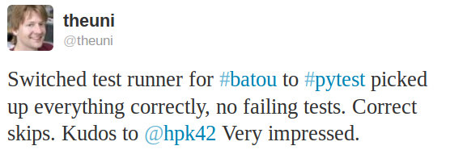

.. _projects:

.. image:: img/gaynor3.png
   :width: 400px
   :align: right

.. image:: img/cramer2.png
   :width: 400px
   :align: right

.. image:: img/keleshev.png
   :width: 400px
   :align: right

Project examples
==========================

Here are some examples of projects using ``pytest`` (please send notes via :ref:`contact`):

* `PyPy <https://pypy.org/>`_, Python with a JIT compiler, running over
  `21000 tests <http://buildbot.pypy.org/summary?branch=%3Ctrunk%3E>`_
* the `MoinMoin <http://moinmo.in>`_ Wiki Engine
* `sentry <https://getsentry.com/welcome/>`_, realtime app-maintenance and exception tracking
* `Astropy <https://www.astropy.org/>`_ and `affiliated packages <https://www.astropy.org/affiliated/index.html>`_
* `tox <https://testrun.org/tox>`_, virtualenv/Hudson integration tool
* `PyPM <https://code.activestate.com:443/pypm/>`_ ActiveState's package manager
* `Fom <https://packages.python.org/Fom/>`_ a fluid object mapper for FluidDB
* `applib <https://github.com/ActiveState/applib>`_ cross-platform utilities
* `six <https://pypi.org/project/six/>`_ Python 2 and 3 compatibility utilities
* `pediapress <http://pediapress.com/code>`_ MediaWiki articles
* `mwlib <https://pypi.org/project/mwlib/>`_ mediawiki parser and utility library
* `The Translate Toolkit <http://toolkit.translatehouse.org/?id=toolkit/index>`_ for localization and conversion
* `execnet <https://codespeak.net/execnet>`_ rapid multi-Python deployment
* `pylib <https://pylib.readthedocs.io/en/stable/>`_ cross-platform path, IO, dynamic code library
* `bbfreeze <https://pypi.org/project/bbfreeze/>`_ create standalone executables from Python scripts
* `pdb++ <https://github.com/pdbpp/pdbpp>`_ a fancier version of PDB
* `pudb <https://github.com/inducer/pudb>`_ full-screen console debugger for python
* `py-s3fuse <https://code.google.com/archive/p/py-s3fuse>`_ Amazon S3 FUSE based filesystem
* `waskr <http://code.google.com/p/waskr/>`_ WSGI Stats Middleware
* `guachi <http://code.google.com/p/guachi/>`_ global persistent configs for Python modules
* `Circuits <https://pypi.org/project/circuits/>`_ lightweight Event Driven Framework
* `pygtk-helpers <https://bitbucket.org/aafshar/pygtkhelpers-main/>`_ easy interaction with PyGTK
* `QuantumCore <http://quantumcore.org/>`_ statusmessage and repoze openid plugin
* `pydataportability <https://comlounge.net/>`_ libraries for managing the open web
* `XIST <http://python.livinglogic.de/xist/>`_ extensible HTML/XML generator
* `tiddlyweb <https://pypi.org/project/tiddlyweb/>`_ optionally headless, extensible RESTful datastore
* `fancycompleter <https://bitbucket.org/antocuni/fancycompleter/src>`_ for colorful tab-completion
* `Paludis <https://paludis.exherbo.org/>`_ tools for Gentoo Paludis package manager
* `Gerald <https://halfcooked.com/code/gerald/>`_ schema comparison tool
* `abjad <https://code.google.com/archive/p/abjad>`_ Python API for Formalized Score control
* `bu <https://packages.python.org/bu/>`_ a microscopic build system
* `katcp <https://bitbucket.org/hodgestar/katcp>`_ Telescope communication protocol over Twisted
* `kss plugin timer <https://pypi.org/project/kss.plugin.timer/>`_
* `pyudev <https://pyudev.readthedocs.io/en/latest/tests/how-to/plugins.html>`_ a pure Python binding to the Linux library libudev
* `pytest-localserver <https://bitbucket.org/pytest-dev/pytest-localserver/>`_ a plugin for pytest that provides an httpserver and smtpserver
* `pytest-monkeyplus <https://pypi.org/project/pytest-monkeyplus/>`_ a plugin that extends monkeypatch

These projects help integrate ``pytest`` into other Python frameworks:

* `pytest-django <https://pypi.org/project/pytest-django/>`_ for Django
* `zope.pytest <http://packages.python.org/zope.pytest/>`_ for Zope and Grok
* `pytest_gae <https://pypi.org/project/pytest_gae/0.2.1/>`_ for Google App Engine
* There is `some work <https://github.com/Kotti/Kotti/blob/master/kotti/testing.py>`_ underway for Kotti, a CMS built in Pyramid/Pylons

Some organisations using pytest
-----------------------------------

* `Square Kilometre Array, Cape Town <https://www.sarao.ac.za/>`_
* `Some Mozilla QA people <https://www.theautomatedtester.co.uk/blog/2011/pytest_and_xdist_plugin/>`_ use pytest to distribute their Selenium tests
* `Shootq <https://shootq.com//>`_
* `Stups department of Heinrich Heine University Duesseldorf <http://stups.hhu.de/projects.php>`_
* cellzome
* `Open End, Gothenborg <https://www.openend.se/>`_
* `Laboratory of Bioinformatics, Warsaw <http://genesilico.pl/>`_
* `merlinux, Germany <https://merlinux.eu/>`_
* `ESSS, Brazil <https://www.esss.co/>`_
* many more ... (please be so kind to send a note via :ref:`contact`)
